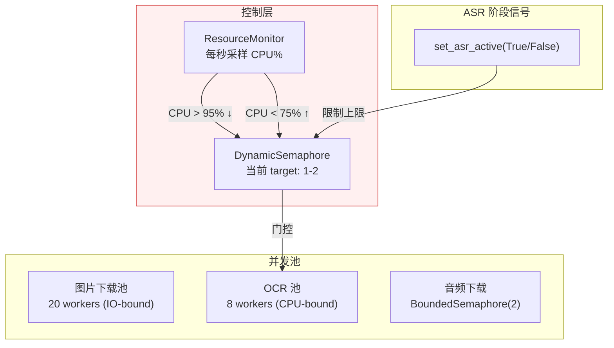
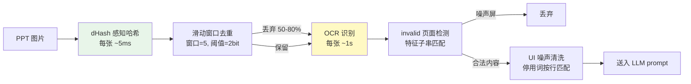

# iCourse Subscriber V2

自动监控复旦大学 iCourse 智慧教学平台的课程更新，对新课次的录播视频进行**语音转文字 + PPT OCR + AI 摘要**，并通过邮件推送到你的邮箱。

部署在 GitHub Actions 上，每天定时运行，**零成本、免服务器、全自动**。

> [!NOTE]
> 本项目严禁大规模传播（例如，不准分享到树洞、班级群、大群等地），否则信息办可能随时ban掉该项目。
> 如果该项目对你有用，请点个**star**⭐作为对作者的鼓励，并将项目**单独**分享给你的好朋友。

## 它能做什么？

假设你选了「摸鱼学导论」和「躺平学原理」两门课。在每天设定的时间，iCourse Subscriber 会自动：

1. 登录你的复旦 iCourse 账号（通过 WebVPN）
2. 检查这两门课是否有新的录播视频
3. 如果有：提取音频 → 语音识别 → 提取 PPT 图片 → OCR 转写 → AI 生成课程笔记
4. 将所有新课次的笔记汇总成**一封邮件**发送给你

邮件包含专业排版的 Markdown 渲染内容（含 LaTeX 公式渲染）。如果老师提到了作业、考试、签到、组队等重要课程事项，会在笔记开头醒目标注。

> [!CAUTION]
> **⚠️ 合规使用声明**
>
> 本项目的设计初衷仅为辅助本校学生进行**个人的日常学习与复习**与进行技术交流。程序采用"封闭容器、流式处理、阅后即焚"的架构，默认不保存任何视频文件。任何人在部署和使用本项目时，必须严格遵守《复旦大学智慧教学资源平台使用规范》及相关校纪校规。**严禁使用者利用本程序进行以下违规操作，一切因滥用导致的账号封禁或纪律处分（如通报批评、限制平台权限等），均由使用者自行承担，与本仓库及作者无关：**
>
> * **严禁二次分发与传播**：《规范》第二部分明确指出，平台教学资源属于职务作品，未经许可不得传播。**禁止**将推送到你邮箱的课程摘要、转录文本或笔记转发给他人，或发布到任何公共网络平台。
> * **严禁修改代码非法下载视频**：《规范》严禁未经许可对平台资源进行复制和下载。基于此，本项目并不留存视频，**严禁**任何人修改源代码将受版权保护的课程录播违规下载、保存到任何本地或云端存储介质。
> * **严禁解密或泄露数据库**：仓库中的 `icourse.db.enc` 仅用于程序追踪课次进度避免重复计算。**严禁**手动解密该数据库以提取、滥用或公开其中的转录和摘要文本信息。
> * **注意账号环境安全**：本程序会使用你的 UIS 凭证进行云端 WebVPN 自动化登录，有触发异地登录风控的可能。请妥善保管个人 Secret，因使用云端自动化服务导致的账号异常风险由使用者自行评估。
>
> **当你 Fork 并配置 Secret 运行本项目时，即代表你已知晓上述风险，并承诺仅在授权范围内为个人学习目的使用本工具，遵守相关校纪校规。**

## 快速部署（5 分钟）

### 第 1 步：Fork 本仓库

点击页面右上角的 **Fork** 按钮，将仓库复制到你的 GitHub 账号下。

### 第 2 步：配置 Secrets

进入你 Fork 后的仓库，点击 **Settings → Secrets and variables → Actions → New repository secret**，逐个添加以下 Secret：

| Secret 名称 | 必填 | 说明 | 示例 |
|---|---|---|---|
| `STUID` | ✅ | 复旦学号 | `22307110000` |
| `UISPSW` | ✅ | UIS 统一身份认证密码 | `your_password` |
| `COURSE_IDS` | ✅ | 要监控的课程 ID，多个用英文逗号分隔 | `35472,30251` |
| `DASHSCOPE_API_KEY` | ⬜ | ModelScope 平台 API Key | `ms-xxxxxxxx` |
| `DEEPSEEK_API_KEY` | ⬜ | DeepSeek API Key（推荐） | `sk-xxxxxxxx` |
| `GEMINI_API_KEY` | ⬜ | Gemini API Key | `AIza...` |
| `SMTP_EMAIL` | ✅ | 用于发送邮件的 QQ 邮箱 | `123456@qq.com` |
| `SMTP_PASSWORD` | ✅ | QQ 邮箱 SMTP **授权码**（不是登录密码） | `abcdefghijklmnop` |
| `RECEIVER_EMAIL` | ✅ | 接收摘要邮件的邮箱 | `you@m.fudan.edu.com` |

> 至少配置一个 LLM API Key（DASHSCOPE、DEEPSEEK 或 GEMINI）。程序按配置顺序自动回退尝试。如果需要选择其他的LLM供应商，可以在`src\runtime\config.py`路径下自定义供应商。

### 第 3 步：获取课程 ID

登录 [iCourse 网页版](https://icourse.fudan.edu.cn)，进入你要监控的课程页面，URL 中的数字就是课程 ID：

多门课用英文逗号隔开：`35472,30251,40123`

### 第 4 步：获取 API Key

选择一个或多个模型服务商：

| 服务商 | 获取方式 | 免费额度 |
|---|---|---|
| **ModelScope**（`DASHSCOPE_API_KEY`） | [API 密钥管理](https://modelscope.cn/my/myaccesstoken) | 每天 2000 次免费调用，推荐 |
| **DeepSeek**（`DEEPSEEK_API_KEY`） | [DeepSeek Platform](https://platform.deepseek.com/) | 注册赠额度 |
| **Gemini**（`GEMINI_API_KEY`） | [Google AI Studio](https://aistudio.google.com/) | flash模型每日免费额度 |

### 第 5 步：获取 QQ 邮箱 SMTP 授权码

1. 登录 [QQ 邮箱](https://mail.qq.com) → 设置 → 账户与安全 → 安全设置
2. 找到「POP3/IMAP/SMTP/Exchange/CardDAV/CalDAV 服务」
3. 开启 SMTP 服务，按提示获取**授权码**（16 位字母）
4. 将授权码填入 `SMTP_PASSWORD`

### 第 6 步：运行

- **自动运行**：默认每天 19:36（北京时间）自动执行
- **手动触发**：进入仓库 → Actions → **iCourse Check** → Run workflow
- **立即触发**：也可通过前端页面点击「触发订阅检查」按钮

首次运行会处理所有已有录播，后续只处理新增课次。

## 前端页面（索引与查看）

本项目自带一个浏览器端加密数据库查看器，部署在 GitHub Pages：

访问 `https://你的用户名.github.io/Fudan_iCourse_Subscriber/`

功能介绍：
- **浏览器端解密**：输入你的凭据，浏览器用 WebCrypto 解密 sql.js 读取 shard 数据库，凭据不离开本地
- **按课程/课次浏览**：查看每节课的转录和摘要内容
- **导出 PDF**：通过 GitHub Actions 触发导出工作流，生成格式化课程笔记 PDF 并邮件发送

> 前端页面需要你手动在 GitHub Pages 设置中开启（Settings → Pages → Source → GitHub Actions），然后触发一次 Deploy Frontend workflow 即可部署。

> [!TIP]
>
> ## V2 更新说明
>
> - 重构了代码架构，清晰的分层化设计。
>
> - 更新了 ASR 系统，引入插件化后端机制，目前支持 SenseVoice（默认）、FireRed 与 Zipformer 三种后端，并新增统一的跨后端后处理流程。
>
> - 引入了 PPT OCR 流水线和清洗机制，通过 PPT 信息引导模型生成更丰富的课程总结。
>
> - 引入新的调度系统，以改善 GitHub Actions 低核数环境下的吞吐与稳定性。
>
> - 更新了数据库结构，从原本的单文件数据库演进为按课程约 10MB 的分片结构，支持前端增量加载与按需读取，降低课程加载开销。
>
> - 新增 GitHub Pages 前端查看器，支持加密数据库浏览、订阅编辑器与 PDF 导出等功能。
>
> - 更新了 LLM 调度逻辑，将原本的单一 provider 调用改为多 provider 列表式自动回退机制。
>
> - 设计了完善的版本过渡机制，V1 可以直接升级为 V2，程序会自动处理所有兼容性问题。

---

## 技术说明

> 以下部分是对本项目技术细节和设计的讨论，欢迎感兴趣的技术读者阅读。

### 调度器：CPU 反馈闭环

OCR 和 ASR 是两个 CPU-bound 工作负载，在 4 核 GitHub Actions runner 上需要共享算力。RapidOCR 每处理一页 PPT 图片约需 1 秒，保持单核 100% 占用；sherpa-onnx ASR 使用 4 线程 ONNX 推理，需要多核。ASR 的优先级高于 OCR——转录延迟会导致音频流中断。

动态信号量：标准库 BoundedSemaphore 不支持在运行时调整并发上限。DynamicSemaphore 在线程安全的基础上增加了 `set_target(n)` 方法，允许在运行时调高/调低并发目标。正在执行的 worker 不受影响（自然结束后不再补充），等待中的 worker 在 target 上调时被唤醒。

资源监控：ResourceMonitor 每秒采样 `psutil.cpu_percent()`，执行迟滞判断（hysteresis control）：当 CPU > 95% 且 target 尚未到达下限时递减 OCR 并发；当 CPU < 75% 且 target 尚未到达上限时递增。双阈值（95%/75%）制造了一个 20% 宽的死区（deadband），避免系统在单个阈值附近震荡。这套逻辑本质上是一个 bang-bang 控制器。

OCR_MAX_TARGET 设为 2 而非 8 的原因是：实际运行数据表明，RapidOCR 在 4 核机器上从未超过 2 个并发 worker——其余核心被 ASR 的 4 线程 ONNX 推理占满。更高的 target 仅导致 ResourceMonitor 频繁调整目标值，对吞吐无贡献。

ASR 阶段通过 `set_asr_active(True/False)` 向调度器主动声明状态。这是一个简单的布尔标志位，不需要细粒度的上下文切换，因为 ASR 和 OCR 是两个完全独立的阶段——ASR 运行时没有 OCR 依赖，反之亦然。

音频下载器使用 `BoundedSemaphore(2)` 限制并发 ffmpeg 数量。2 是理论最小值：当前转录课次需要一路，预取课次需要另一路。在 runner 的网络带宽下，两路 ffmpeg 公平共享带宽，各获得约 10 MB/s，远高于 ASR 消费速率。

### 语音识别：后处理优于更好的模型

该模块经历了 SenseVoice → FireRed → SenseVoice 的三次选择。FireRed 的转录文本更"干净"（纯中文 + 英文，无跨语种污染），但 SenseVoice 的实时倍率约 25x，FireRed 仅约 6x。在 348 节课的批量场景中，FireRed 的 ASR 总时长为 2h41m，SenseVoice 降至约 37m。当将两种模型的输出分别输入 DeepSeek-V4-Pro 生成摘要时，LLM 的摘要质量差异不显著——LLM 自动忽略了 SenseVoice 混入的日语假名和韩语谚文。

最终选择 SenseVoice 并附加后处理。后处理函数在每条 ASR segment 加入 segments 列表前执行多级清洗：删除日语假名和平假名/片假名 Unicode 区块、删除韩语谚文 Unicode 区块、删除英文 filler word 白名单（yeah, okay, uh, um, hmm 等）、删除 `<sil>` 和 `<|zh|>` 等 bracket token。技术英文（CNN, YOLO, Transformer）通过 `\b` 单词边界匹配不受影响。

每条清洗规则都经过 7 节课 × 5 门课的真实 OCR 数据验证。选择保留"well"——"well-defined"、"well-known"在技术英文中合法。

VAD 参数调优：Silero VAD 的默认 `min_silence_duration=0.25s` 在课堂场景中将老师的换气、翻页、停顿都切分为独立片段。每个片段需要一次 ASR decode，且 SenseVoice 在短片段（2-3s）上的语言检测倾向于误判为日语（因为缺乏上下文）。将参数调至 0.8s，并将 `max_speech_duration` 设为 30.0s（匹配 SenseVoice 训练感受野）。片段数量减少约 60%，日语误判率大幅下降。

### PPT 流水线：计算成本驱动的去重策略

iCourse 录播系统每 20-30 秒截取桌面截图。90 分钟课程产生约 200-300 张图片，其中大量是同一张幻灯片的重复截图。直接 OCR 全部图片将浪费大量计算时间和 LLM prompt token 预算。

去重采用两阶段策略：先以 dHash 感知哈希做粗筛，再以 OCR 文本分类做精筛。dHash 的计算成本约每张几毫秒，而 OCR 约每张 1 秒——因此在 OCR 之前执行。

滑动窗口去重有一个关键实现细节：已丢弃的页面不成为锚点。防止级联效应——如果第 1 页与第 3 页相似（第 3 页被丢弃），第 2 页与第 4 页相似但第 1 页与第 4 页无关，我们不希望第 1 页引发第 3 页被丢弃后，第 3 页又作为锚点引发第 4 页被丢弃。

OCR 之后执行 invalid 页面检测：通过特征子串匹配（约 20 条模式，如"请不要关闭设备""cfdfudaneducn""智慧教学资源平台使用规范"）识别教室桌面壁纸和 iCourse 资源平台启动页。归一化去掉所有非字母数字字符以容忍 OCR 轻微变异。

PPT 功能区 UI 噪声清洗：PowerPoint 功能区标签（"文件""开始""插入""设计"……）每次截图都被 OCR 识别，占用了 8-18% 的 LLM prompt token。清洗采用按行精确匹配策略，而非子串匹配——例如"选择"在功能区是按钮，在生物学"自然选择"中是正常文本。功能区标签在截图中独占一行，而同一词汇出现在课程内容中时周围有其他文字。100+ 条停用词在 7 节课 × 5 门课数据中零误删。

### 数据库持久化：三环境兼容的加密 + 内容寻址分片

GitHub Actions 每次在全新容器中运行，无法依赖本地文件系统持久化。解决方案是独立的 `data` 分支，每次运行结束时加密推送数据库，下次运行时拉取解密。

AES-256-CBC + PBKDF2 加密方案需要在三种环境中同时兼容：GitHub Actions shell（openssl CLI）、Python（pycryptodome 库）、浏览器前端（Web Crypto API）。`crypto_box.py` 和 `frontend/js/crypto.js` 保持精确对应——相同的 Salted__ 头部格式、相同的 PBKDF2 迭代次数、相同的 AES-256-CBC 模式。密钥由 `sha256("ICSv2:" + stuid + ":" + uispsw)` 派生。

分片的动机是增量传输。数据库约 20MB，通过 GitHub API 完整拉取会显著增加前端加载时间。按课程分组切割为 ~10MB 的 shard，每个独立加密。前端使用 git blob SHA 作为缓存键存储于 IndexedDB，未变化的 shard 自动跳过网络下载、解密、解压。

并发合并策略：两个 workflow 可能并行执行并同时写入数据库。`merge_db.py` 采用 field-level COALESCE——非空覆盖空、版本号取 MAX、错误字段在成功处理后清零。此策略是 CRDT（Conflict-Free Replicated Data Type）的简化版本，不能解决所有冲突（例如两个 workflow 对同一字段的并发写入），但在实际场景中，同一 lecture 不会被两个 workflow 同时处理，因此冲突概率足够低。

Schema 迁移：新增列时，旧的 shard 与新的 schema 之间存在列数不匹配的兼容性问题。`_migrate_shard_schema()` 在 INSERT 之前对每个 attached shard 执行 PRAGMA table_info 差集检查并通过 ALTER TABLE ADD COLUMN 补齐，将 schema 迁移与 shard 管理解耦。

### 前端：在静态页面中解密远程数据库

前端是运行在 GitHub Pages 上的纯静态单页应用，无后端服务器。它通过 GitHub raw API 拉取位于 `data` 分支的加密 shard，在浏览器中使用 Web Crypto API 解密，并利用 sql.js（SQLite WebAssembly 编译）在内存中构建数据库。

解密凭证（STUID + UISPSW）通过 PBKDF2 派生密钥，不经过网络传输，在浏览器本地内存中完成解密。

订阅编辑器解决了一个特殊的约束：GitHub Actions Secrets API 只支持写入，不支持读取——无法通过 API 获知当前 COURSE_IDS 的值。方案采用三层数据源：数据库 `courses` 表（实际运行过的课程）提供默认订阅状态；localStorage `lastSubscribed` 维护用户前次编辑后的状态；保存时通过 GitHub API 将选择列表写入 `COURSE_IDS` Secret。

### 技术方法总结

- **控制理论**：ResourceMonitor 的双阈值迟滞比较器（deadband control），防止在单个阈值附近震荡。
- **排队论**：DynamicSemaphore 的可调整并发池，系统过载时减少服务窗口，负载下降后恢复。不影响正在服务的 worker，只影响等待队列。
- **CRDT 思想**：merge_db.py 的 field-level COALESCE，最终一致的并发合并策略。
- **内容寻址存储**：前端以 git blob SHA 为 shard 缓存键，相同内容产生相同 SHA 的特性直接复用。
